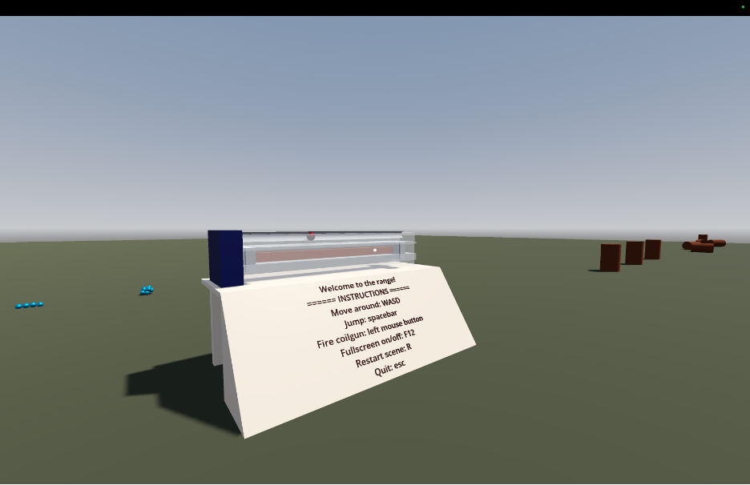

# Working coilgun with custom-made magnet physics

Author: Christian Caamano

Email: christian.d.caamano@vanderbilt.edu

VUNetID: caamancd

Class: CS 3981 - Game Engine Design

Instructor: Bobby Bodenheimer

#### Link to demo video: https://www.youtube.com/watch?v=sdcfjFty9Fc

## Description & Functionality

Module name: MagneticBody3D

Description: This module extends the Jolt physics engine by introducing magnetic objects with custom properties. The module itself extends the RigidBody3D node and supports the following capabilities/functionalities:

1. A MagneticBody3D can have one of three types: Permanent, Temporary, and Electromagnet. This can be configured in the editor.
- Permanent magnets are always on.
- Temporary magnets become "magnetized" in the presence of a permanent magnet or another magnetized temporary magnet. For the purposes of this module, this effect is permanent (once it becomes magnetized, it will remain so for the remainder of the scene). Note that being magnetized is a separate property from being on/off.
- Electromagnets act like permanent magnets, but can be turned on and off on demand.
2. Magnets that are marked as off will not be processed by the module until turned on.
3. Every MagneticBody3D is implemented as a spherical (point source) magnetic dipole, with pole direction defined by the orientation of object's local Z axis.
4. Magnets will attract/repel each other depending on their 3D orientation, and will attempt to align their opposing poles together. In other words, magnets experience an attractive/repulsive force, as well as an alignment torque.
5. A magnet's strength can be configured in the editor.
6. Each magnet has a certain sphere of influence proportional to its strength. The higher a magnet's strength, the larger its sphere of influence. Other magnets within this sphere will be influenced by this magnet (i.e., will experience a force and torque), while ones outside the sphere will not be affected.
7. Electromagnets can be turned on and off in GDScript.

The module has a sibling debugging module titled MagneticDebugDraw, which extends Node3D.
This debugging module enables realtime visualization of the sphere of influence of all magnets in the scene that are currently on, as well as all the forces currently influencing each magnet.

## Testing

To test the module, a 3D "coilgun" was made, involving a linear array of block-shaped electromagnets in the scene and a custom timing script. Using the script, these magnets were turned on and off in a precise sequence to launch a temporary magnet projectile.
Testing was successful, though a limitation with temporary magnets was discovered.

An additional smaller test was made involving ball magnets (permanent type magnets). About a dozen ball magnets were spaced apart from each other in a rough grid. Upon running the scene, these magnets clustered together. Testing was successful, though fine-tuning mass and strength properties for realistic interactions proved challenging.

## Limitations & Areas for Improvement

1. In the current implementation, once temporary magnets have become 'magnetized', they will remain magnetized for the remainder of the scene. However, true temporary magnets in the real world are temporary: they become magnetically inert upon exiting a magnetic field. As much as I wanted to create this level of realism, implementing it would have required handling certain complex cases explicitly (e.g., magnet chains and clusters), altering the module's core processing logic significantly. This would have broadened the scope of the module to an extent unmanageable for this assignment, so I decided to stick with the limited approach.

2. In the current implementation, magnets are treated as points; that is, the shape of any visual mesh set as a child of the MagneticBody3D will have no effect on physics processing or magnetic properties. A more robust implementation of this module may incorporate shape/mesh-dependent magnetism to achieve greater realism.

## Compilation Instructions

Compilation instructions are for MacOS devices.

To run the demo, perform the following steps:
1. Clone this repository to your device.
2. Open Godot, click "Import" and open the folder in this repository named "coilgun_project".
3. Open this project in the editor and click play. Use WASD to move, spacebar to jump, mouse to look around, and left mouse button to fire the coilgun. Toggle fullscreen on/off with F12.
4. If an error is encountered, please contact me at my email.